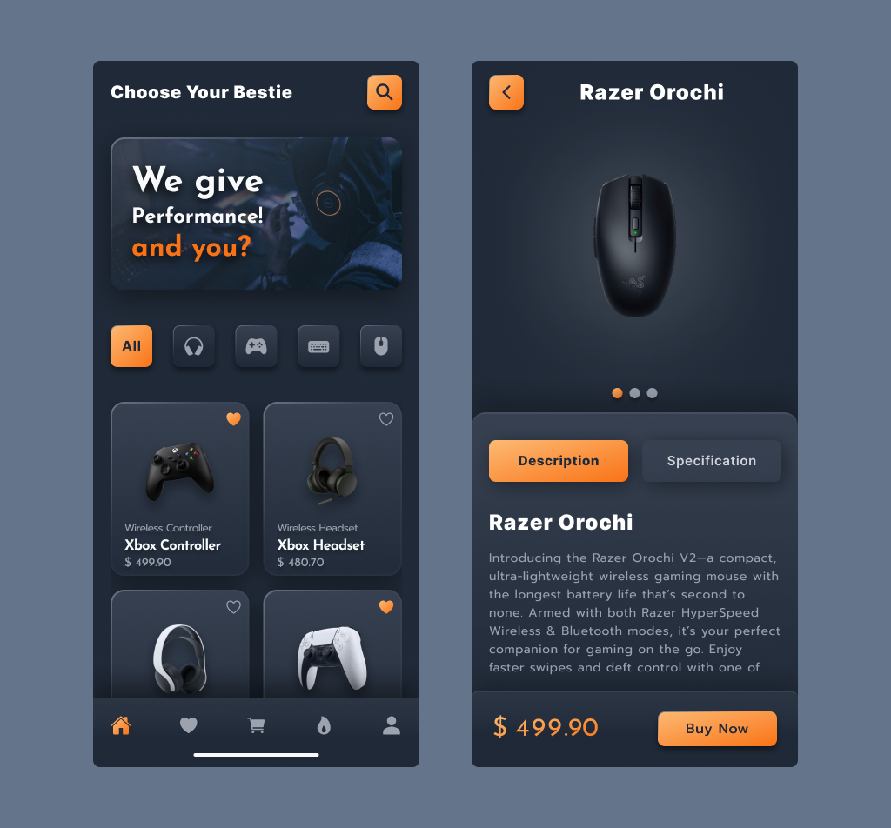

# PeriferPlus - Projeto de Desenvolvimento de API para E-commerce de Periféricos

## Introdução

O **PeriferPlus** é uma aplicação de interface voltada para a venda de periféricos de computador. Esta aplicação é desenvolvida com as seguintes tecnologias:

- **Backend:** TypeScript com Node.js utilizando Fastify.
- **Frontend:** React.js com Tailwind CSS.
- **Banco de Dados:** PostgreSQL.

A aplicação está estruturada para fornecer uma experiência completa tanto para os clientes quanto para os administradores.

## Requisitos Funcionais

1. **Cadastro de Produtos**
   - Adicionar, editar, excluir e listar produtos.
   - Cada produto deve conter informações como nome, descrição, preço, categoria, marca, estoque, imagens, etc.

2. **Cadastro de Usuários**
   - Sistema de registro e login de usuários.
   - Perfis de usuários contendo informações pessoais, histórico de compras, etc.

3. **Carrinho de Compras**
   - Adicionar e remover produtos do carrinho.
   - Atualizar quantidade de produtos no carrinho.
   - Exibir resumo do carrinho com preço total e itens.

4. **Processamento de Pedidos**
   - Checkout com cálculo de frete e impostos.
   - Escolha de métodos de pagamento (cartão de crédito, PayPal, etc.).
   - Geração de fatura e confirmação de pedido.

5. **Gestão de Estoque**
   - Atualização automática de estoque após a compra.
   - Notificação de baixa de estoque.

6. **Busca e Filtros**
   - Busca por produtos com base em nome, categoria, marca, etc.
   - Filtros por preço, popularidade, novidades, etc.

7. **Avaliações e Comentários**
   - Permitir que usuários deixem avaliações e comentários nos produtos.
   - Moderação de comentários.

8. **Painel Administrativo**
   - Dashboard para gerenciamento de produtos, pedidos, usuários e estoque.
   - Relatórios de vendas e desempenho.

## Regras de Negócio

1. **Gerenciamento de Descontos**
   - Aplicar descontos por cupom, quantidade comprada ou promoções temporárias.
   - Definir regras de validade para os cupons.

2. **Política de Devolução**
   - Regras claras para devolução de produtos, prazo e condições.
   - Processo de autorização de devolução e estorno de pagamento.

3. **Controle de Acesso**
   - Diferenciação de permissões entre administradores, vendedores e clientes.
   - Regras para ações específicas de acordo com o nível de acesso.

4. **Fidelização de Clientes**
   - Programa de pontos ou recompensas por compras realizadas.
   - Descontos exclusivos para clientes frequentes.

## Requisitos Não-Funcionais

1. **Segurança**
   - Autenticação e autorização seguras (ex: JWT).
   - Proteção contra ataques comuns como SQL Injection, XSS, CSRF.
   - Criptografia de dados sensíveis (ex: senhas, informações de pagamento).

2. **Desempenho**
   - Respostas rápidas da API com tempos de resposta baixos.
   - Suporte para grande volume de acessos e dados.

3. **Escalabilidade**
   - Arquitetura preparada para crescimento do número de usuários e transações.
   - Uso de serviços em nuvem para balanceamento de carga e armazenamento.

4. **Usabilidade**
   - Interface de usuário intuitiva e fácil de navegar.
   - Design responsivo para dispositivos móveis e diferentes tamanhos de tela.

5. **Manutenibilidade**
   - Código bem documentado e modularizado.
   - Testes unitários e de integração para garantir a qualidade do código.

6. **Conformidade**
   - Adesão a regulamentações de proteção de dados (ex: GDPR, LGPD).
   - Conformidade com padrões de acessibilidade web (ex: WCAG).

## 🛠️ Construído com

* [Typescript](https://www.typescriptlang.org/docs/) - Linguagem de Programação
* [NodeJS](https://nodejs.org/pt-br/docs) - Plataforma de Desenvolvimento Backend
* [Postgres](https://www.postgresql.org/docs/) - Banco de Dados Relacional
* [React](https://pt-br.legacy.reactjs.org/) - Framework de Interfaces 
* [Tailwind](https://tailwindcss.com/docs/) - Biblioteca de Estilização

Design feito no [Figma](https://www.figma.com/file/O2iXxZphSEmo6E9LglOKUo/AsaySolution?type=design&node-id=130-2&mode=design&t=8u53HUboeVHIFkey-0)

## Documentação da API (Swagger)

Para documentação da API, acesse o link: https://

## Banco de dados

Utilizado banco de dados relacional (SQL). Para ambiente de desenvolvimento o SQLite pela facilidade do ambiente.

---
Desenvolvido por [Edilson Júnior](https://github.com/edilsonfj)

